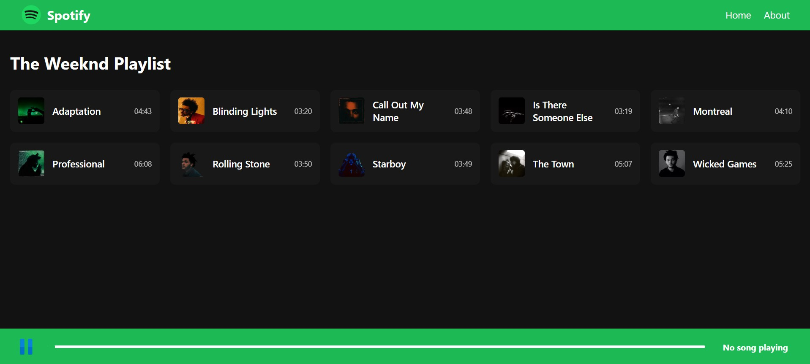

# Spotify Clone 🎵

A simple Spotify web app clone built using HTML, CSS, and JavaScript.

This project was created for practice to learn front-end development, including responsive layouts, basic DOM manipulation, and audio player controls.

## Features

- Play and pause songs
- Dynamic playlist
- Progress bar with seeking functionality
- Responsive design for mobile and desktop
- Next song autoplay
- Dark/light styled layout

## Live Demo 🚀

Check it out here: [Spotify Clone](https://spotify-clone.netlify.app/)

## Technologies Used

- HTML5
- CSS3
- JavaScript (ES6)

## Screenshots

## Future Improvements

- Add shuffle and repeat functionality
- Implement user login (dummy version)
- Improve playlist design
- Add volume control

## License

This project is open source and free to use.

// Commit on Thu Apr 06 17:02:45 2023: Update README with project information